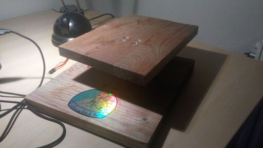
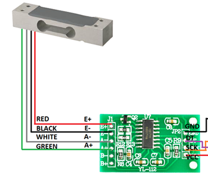
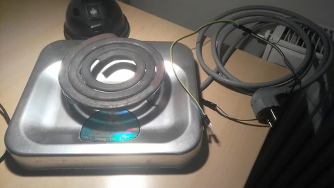

```
db    db  .d8b.  d8888b.    d8888b. d888888b db    db  .d88b.  
88    88 d8' `8b 88  `8D db 88  `8D   `88'   88    88 .8P  Y8. 
Y8    8P 88ooo88 88oobY' VP 88oodD'    88    Y8    8P 88    88 
`8b  d8' 88~~~88 88`8b      88~~~      88    `8b  d8' 88    88 
 `8bd8'  88   88 88 `88. db 88        .88.    `8bd8'  `8b  d8' 
   YP    YP   YP 88   YD VP 88      Y888888P    YP     `Y88P'  
```

# Analýza problematiky
Varenie piva v domácich podmienkach je časovo náročné, a veľká časť tohoto času spočíva len v čakaní a regulovaní teploty.
Tento aspekt procesu by bolo možné jednoducho zautomatizovať a tým varenie zjednodušiť.

## Proces varenia piva
Z vlastných skúseností s výrobou domáceho piva sme identifikovali nasledovný proces, ktorý budeme automatizovať:
 1. Naplnenie hrnca vodou
 2. Zohriatie vody na požadovanú teplotu pre lúhovanie sladu
 3. Po dosiahnutí teploty vloženie sladu
 4. Udržovanie teploty určitý čas (podľa receptu)
 5. Kroky 3 a 4 sa môžu opakovať s inou teplotou a ďalšími sladmi
 6. Vybratie sladu
 7. V niektorých prípadoch sa opakuje 3 a 4, tentokrát bez sladu
 8. Privedenie k varu
 9. Keď začne obsah hrnca vrieť, začíname stopovať čas, po ktorý udržujeme var
 10. Pridanie surovín, ktoré sa majú pridať počas varu (podľa receptu). Rôzne suroviny (chmele a iné) sa v praxi nevyberajú, 
    nýbrž sa pridávajú podľa toho, koľko času ostáva do konca varu.
 11. Uplynutím doby varu končí časť procesu výroby, na ktorú sa tento projekt zameriava.
 
## Recepty
Pre recepty na výrobu piva existuje otvorený štandard BeerXML[1]. Pre potreby tohoto projektu 
budeme vychádzať z receptov v tomto formáte, napriek tomu že má isté nedokonalosti. Zvolili sme ho aj z toho dôvodu,
že ho dokážeme získať zo služieb na tvorbu týchto receptov ktoré používame, akou je napríklad Brewer's friend [2]

## Použité technológie
 - Raspberry Pi - Raspbian
 - Indukčná varná doska
 - Elektrická varná platnička
 - DS1820 teplotné čidlo
 - HX711 AD prevodník na hmotnostné senzory
 - Hmotnostné senzory
 - Relé modul s optickým oddelením
 - OLED displej

# Opis postupu riešenia
V tejto časti opíšeme prípravu hardvéru, ako aj tvorbu softvéru pre tento systém.

## Požiadavky na systém
Vytváraný systém by mal ponúkať nasledovné funkcionality:
 - Možnosť načítania receptu z BeerXML súboru
 - Zobrazenie zoznamu surovín s ich množstvom
 - Možnosť kedykoľvek vidieť hmotnosť z váhy
 - Možnosť vynulovať váhu
 - Zobrazenie aktuálnej teploty v hrnci
 - Zobrazenie aktuálneho stavu jednotlivých krokov
 - Možnosť zrušiť varenie
 - Možnosť nakalibrovať váhu
 - Možnosť predčasne ukončiť jednotlivé kroky, ako aj celý proces varenia
 
Ďalej by mal systém spĺňať nasledovné požiadavky:
 - Váha musí mať nosnosť aspoň 9kg (postačujúce pre objem sladu v domácich podmienkach)
 - Teplomer musí zvládnuť meranie teploty od 0 do 100°C
 - V prípade chyby sa musí vypnúť ohrev


## Hardvér
V tejto časti opíšeme výrobu a zapojenie hardvéru.

### Váha
Na váhu sme použili dva hmotnostné senzory s nosnosťou po 5kg. Tieto sú pripevnené na podstavu a na vážiacu plochu (viď obrázky).  

  
Oba tieto senzory sú zapojené do AD prevodníka HX711, každý do jedného z 2 kanálov. Senzory sú zapojené nasledovne:  
  
(obrázok prevzatý z: [StackExchange - Mr.Sky](https://electronics.stackexchange.com/q/260758))
Na obrázku je ukážka zapojenia jedného senzora, druhý sme zapojili analogicky - biely a zelený kábel na kanál B,
červený a čierny rovnako na E.

K Raspberry Pi je HX711 pripojený nasledovne:
```
HX711                   RPi
GND ------------------> Pin#30 (Ground)
DT -------------------> Pin#29 (GPIO05)
SCK ------------------> Pin#31 (GPIO06)
VCC ------------------> Pin#04 (DC - 5V)
```

### Ohrev
Pôvodný plán bol na ohrev použiť vyradenú indukčnú varnú dosku, ktorú by systém ovládal. Keďže moderné
varné dosky sú však samé o sebe vnorenými systémami, museli sme nájsť spôsob komunikácie medzi ovládacím panelom dosky a
jej riadiacou časťou, ktorú by sme mohli zreprodukovať s Raspberry Pi. Po neúspešnej komunikácii s výrobcom samotnej dosky, 
ako aj obvodov v nej použitých, sme sa podujali komunikáčný protokol analyzovať pomocou logického analyzátora. 
Tento počin tiež skončil neúspechom, pri ktorom si to odniesol samotný ovládací panel, notebook, ku ktorému bol pripojený logický analyzátor a pravdepodobne aj samotný logický analyzátor spolu s riadiacou elektronikou.
Po tomto krásnom ohňostroji sme plán použíť indukčný ohrev presunuli na vedľajšiu koľaj a hľadali alternativy.

Nakoniec sme použili varnú dosku s obyčajnou špirálou o výkone 600W a dorobili sme k nej riadenie pomocou opticky oddeleného relé modulu.
Regulovanie teploty bude riešené binárne - hreje alebo nehreje.  
  
Relé modul má 3 piny: napájanie (5V - VCC), zem (GND) a vstup (IN1). Ich zapojenie na Raspberry Pi vyzerá nasledovne:
```
Relay                   RPi
VCC ------------------> Pin#02 (DC 5V)
GND ------------------> Pin#20 (Ground)
IN1 ------------------> Pin#18 (GPIO24)
```

### Teplomer

Ako teplomer sme použili vodotesné teplotné čidlo DS1820 a knižnicu [W1Thermsensor](https://github.com/timofurrer/w1thermsensor) [4].
K Raspberry Pi je pripojený nasledovne:
```
DS1820                  RPi
VCC ------------------> Pin#17 (DC 3,3V)
                 |
                R1 = 4,7kOhm
                 |
Data -----------------> Pin#07 (GPIO04)
GND ------------------> Pin#09 (Ground)
```

### Displej
Displej nie je esenciálnou súčasťou systému a je možné fungovať aj bez neho. Pridali sme ho najmä pre pohodlie na zobrazovanie
aktuálnych informácií o teplote, hmotnosti na váhe a stave ohrevu. Využíva knižnicu
[luma.oled](https://github.com/rm-hull/luma.oled) [9]. Pripojený je cez I2C zbernicu nasledovne:
```
OLED                    RPi
VCC ------------------> Pin#01 (DC 3,3V)
GND ------------------> Pin#06 (Ground)
SCL ------------------> Pin#05 (GPIO02)
SDA ------------------> Pin#03 (GPIO03)
```

## Softvér

Použili sme architektúru klient server. Klientom je responzívna webová SPA napísaná v jazyku Elm [5] využívajúca knižnice
pre Material Design [6] a Bootstrap [7].

Server beží na Pythone a využíva framework [Quart](https://gitlab.com/pgjones/quart) [8].
Spracovávanie na serveri beží v event-loope, takže procesor blokujú iba nevyhnutné operácie a efektívne plánovanie jednotlivých úloh
 umožňuje splniť všetky potrebné funkcie bez nutnosti komplikovaného manažmentu úloh a použitia viacerých procesov.
 
Momentálne na Raspberry Pi beží Raspberry Pi OS ale riešenie nie je naň striktne naviazané.

Na primárnu komunikáciu sa využíva REST API s OpenAPI špecifikáciou a na posielanie správ zo serveru na klienta WebSocket.

Celý vnorený sýstém je veľmi veľmi soft RT systém, keďže miernym (ani výraznejším) oneskorením sa nič zásadné nestane.

Stav aplikácie je v priebehu varenia reprezentovaný krokmi receptu. Tieto sa získajú priamo z BeerXML receptu pri štarte aplikácie.
Každý krok môže byť v niektorom z týchto stavov:
1. Nedostupný - neboli ukončené všetky kroky, na ktorých je tento krok závislý,
2. Dostupný - krok je možné odštartovať
3. Začatý - krok sa vykonáva, či už ide o krok riadený systémom (zmena, udržiavanie teploty) alebo vykonávaný fyzicky používateľom (váženie, pridávanie surovín)
4. Ukončený
Posunúť sa môže len do stavu s vyšším číslom. Po ukončení kroku sa automaticky spustia tie, ktoré sa týmto dostali do stavu 2.
Po ukončení všetkých krokov receptu sa vypína ohrev.

Kroky spočívajúce v zmene alebo udržiavaní teploty riadi systém - v slučke každú sekundu kontroluje teplotu v hrnci.
Pokiaľ je teplota vyššia ako požadovaná, vypína ohrev, v opačnom prípade ho zapína. Ohrev sa zapne vyslaním signálu LOW
do relé modulu. Krok sa ukončí pri dosiahnutí požadovanej teploty, resp. po uplynutí požadovaného času. Aj do tohoto má
však používateľ možnosť zasiahnuť predčasným ukončením kroku.

Systém taktiež pri každom začatí a ukončení kroku uloží svoj stav na disk. Tým pádom je možné po prípadnom reštarte pokračovať
v začatom varení. Pri krokoch udržiavajúcich teplotu sa ukladá reálny čas, kedy sa má krok skončiť, 
aby prípadný čas výpadku neovplyvnil celkové trvanie daného kroku.

Systém taktiež v prípade výpadku alebo ukončenia z dôvodu bezpečnosti vypne ohrev. Keďže má použitá špirála vysokú 
teplotnú zotrvačnosť, krátky výpadok výrazne teplotu neovplyvní.

### Aplikácia
Domovská obrazovka pokiaľ sa nič nevarí zobrazuje zoznam dostupných receptov.  
  
Po kliknutí na recept sa zobrazí zoznam surovín potrebných na jeho uvarenie.  
  
Po kliknutí na tlačidlo *Brew!* a potvrdení, že chceme naozaj začať variť, sa zobrazí zoznam krokov vybraného receptu.  
  
V tomto momente je odštartované varenie a aplikácia zobrazuje teplotu z teplomera. Dostupné kroky je možné odštartovať.
Po kliknutí na kroky s vážením surovín sa zobrazí obrazovka s váhou, ktorá ukazuje aj čo sa má pre daný krok navážiť, aj
požadované množstvo. Tlačidlom *Tare* sa váha vynuluje, Tlačidlom *Confirm* sa potvrdí navážené množstvo a krok sa označí ako ukončený.
Váhu pre vybraný krok je možné opäť otvoriť aj po jeho ukončení.  
  
Po ukončení niekoľkých krokov vyzerá zoznam nasledovne. Vidíme, že práve prebieha krok udržiavania teploty po dobu 60
minút, a je na začiatku. V prípade potreby ho môžeme ukončiť tlačidlom *Finish*. Indikátor na spodnej lište ukazuje, že je zapnutý ohrev.  


# Výsledky riešenia a ich zhodnotenie
Všetko by to bolo skvelé, ale prečo to ten merák celé, 
všetko by to bolo skvelé, ale prečo to ten sprostý merák vyskratoval... :)

Na vytvorenom zariadení sme síce zatiaľ nevarili, ale už teraz môžeme s hrdosťou prehlásiť že:
- Vytvorené zariadenie môže otočiť smerovanie domácej výroby piva o 365°.
- Neobmedzuje sa nutne len na varenie piva. Riešenie je dostatočne všeobecné a po vytvorení konktrétneho formátu receptu by malo byť možné ho použiť aj na varenie iných substancií.


# Zoznam použitej literatúry
1. [The BeerXML Beer Recipes Exchange Standard](http://beerxml.com/)
2. [Brewer'sFriend - Homebrew Beer Recipes, Calculators, and Forum](https://www.brewersfriend.com/)
3. [Zapojenie HX711](https://electronics.stackexchange.com/q/260758)
4. [W1Thermsensor](https://github.com/timofurrer/w1thermsensor)
5. [Elm language](https://elm-lang.org/)
6. [Quart](https://gitlab.com/pgjones/quart)
7. [Material Components for Elm](https://package.elm-lang.org/packages/aforemny/material-components-web-elm/latest/)
8. [Elm Bootstrap](http://elm-bootstrap.info/)
9. [Luma oled](https://github.com/rm-hull/luma.oled)
49. Jones, A. & Morrissey, N. (2018). 1001 beers you must try before you die. London: Cassell Illustrated.
50. [Raspberry Pi 4 GPIO Pinout](https://www.element14.com/community/servlet/JiveServlet/showImage/102-92640-8-726998/GPIO-Pi4.png)  
    

Recept na prvé testovacie pivo, ktorý možno vidieť na snímkach obrazovky aplikácie, poskytol [Bc. Bohumír Coufal](https://www.brewersfriend.com/homebrew/brewer/229495/bohumr).

# Technická dokumentácia
V tejto časti prikladáme technickú dokumentáciu k projektu.

## Zoznam súčiastok
- Raspberry Pi 4
- 2 * Váhový senzor 5kg
- HX711 AD prevodník pre váhové senzory
- Digitálne teplotné čidlo s DS18B20, vodeodolné
- Rezistor 4,7 - 10 kOhm, momentálne použitý 4,7 kOhm
- Relé modul 1x 10A/250V s optickým oddelením
- Elektrická varná doska (prípadne akýkoľvek zdroj ohrevu, ktorý je možné ovládať vypínaním a zapínaním jeho napájania)
- OLED displej 1,3"
- Prepojovacie vodiče

## Dokumentácia REST API
Kompletná dokumentácia je dostupná [TU](docs/api/README.md).

Class | Method | HTTP request | Description
------------ | ------------- | ------------- | -------------
*BrewSessionStatusApi* | [**deleteBrewStatus**](docs/api/Apis/BrewSessionStatusApi.md#deletebrewstatus) | **DELETE** /status | Reset state - unselect any selected recipe
*BrewSessionStatusApi* | [**getBrewStatus**](docs/api/Apis/BrewSessionStatusApi.md#getbrewstatus) | **GET** /status | Get currently selected recipe with steps
*RecipeStepsApi* | [**deleteStepStart**](docs/api/Apis/RecipeStepsApi.md#deletestepstart) | **DELETE** /step/{stepId} | Finish specified step
*RecipeStepsApi* | [**postStepStart**](docs/api/Apis/RecipeStepsApi.md#poststepstart) | **POST** /step/{stepId} | Start specified step
*RecipesApi* | [**getRecipe**](docs/api/Apis/RecipesApi.md#getrecipe) | **GET** /recipe/{recipeId} | Get single recipe
*RecipesApi* | [**getRecipeList**](docs/api/Apis/RecipesApi.md#getrecipelist) | **GET** /recipe | Retrieve all available recipes
*RecipesApi* | [**postRecipe**](docs/api/Apis/RecipesApi.md#postrecipe) | **POST** /recipe/{recipeId} | Select recipe and start brew session
*ScaleApi* | [**deleteScaleRes**](docs/api/Apis/ScaleApi.md#deletescaleres) | **DELETE** /scale | Tare the scale
*ScaleApi* | [**patchScaleRes**](docs/api/Apis/ScaleApi.md#patchscaleres) | **PATCH** /scale | Start scale calibration
*ScaleApi* | [**putScaleRes**](docs/api/Apis/ScaleApi.md#putscaleres) | **PUT** /scale | Find scale reference units, after weight was PUT on the scale
*WSApi* | [**getWebSocketKeg**](docs/api/Apis/WSApi.md#getwebsocketkeg) | **GET** /brizolit/je/cesta/neprestrelna/vesta | Resource format for WS messages
*WSApi* | [**postWebSocketKeg**](docs/api/Apis/WSApi.md#postwebsocketkeg) | **POST** /brizolit/je/cesta/neprestrelna/vesta | Format of WS message with temperature


# Príloha A - Recept na pivo
HOME BREW RECIPE:  
Title: Peačovina neipa  
Author: Bohumír Coufal  

Brew Method: BIAB  
Style Name: Specialty IPA: New England IPA  
Boil Time: 60 min  
Batch Size: 5 liters (fermentor volume)  
Boil Size: 11.4 liters  
Boil Gravity: 1.031  
Efficiency: 70% (brew house)  

Hop Utilization Multiplier: 1  

STATS:  
Original Gravity: 1.062  
Final Gravity: 1.014  
ABV (standard): 6.28%  
IBU (tinseth): 42.16  
SRM (morey): 6.98  
Mash pH: 5.83  

FERMENTABLES:  
0.3 kg - Vienna (18.2%)  
0.2 kg - Wheat Malt (12.1%)  
0.125 kg - Caramel 50 Malt(20L) (7.6%)  
0.125 kg - Flaked Oats (7.6%)  
0.7 kg - Pilsner Zero Malt (42.4%)  
0.2 kg - Peach - (late addition)  (12.1%)  

HOPS:
7 g - Centennial, Type: Pellet, AA: 10, Use: Boil for 60 min, IBU: 42.16  
30 g - Centennial, Type: Pellet, AA: 10, Use: Dry Hop for 7 days  
30 g - Ekuanot, Type: Pellet, AA: 14.25, Use: Dry Hop for 7 days  

MASH GUIDELINES:
1) Infusion, Temp: 65 C, Time: 60 min, Amount: 11.4 L, Mash for 60 minutes on 65°C
2) Sparge, Temp: 72 C, Amount: 3 L, Sparge with 3L 

YEAST:  
Fermentis / Safale - English Ale Yeast S-04  
Starter: No  
Form: Dry  
Attenuation (avg): 75%  
Flocculation: High  
Optimum Temp: 12.22 - 25 C  
Fermentation Temp: 20 C  
Pitch Rate: 0.35 (M cells / ml / deg P)  

PRIMING:  
Method: dextrose  
Amount: 33.8 g  
CO2 Level: 2.4 Volumes  

TARGET WATER PROFILE:  
Profile Name: Light colored and hoppy  
Ca2: 57    
Mg2: 15  
Na: 0  
Cl: 0  
SO4: 0  
HCO3: 126  
Water Notes:  

NOTES:  
Yeast - Brewartech New England IPA 10 g   

This recipe has been published online at:  
https://www.brewersfriend.com/homebrew/recipe/view/1083098/peaovina-neipa  

Generated by Brewer's Friend - https://www.brewersfriend.com/  
Date: 2020-12-02 22:44 UTC    
Recipe Last Updated: 2020-11-25 16:09 UTC   

 

